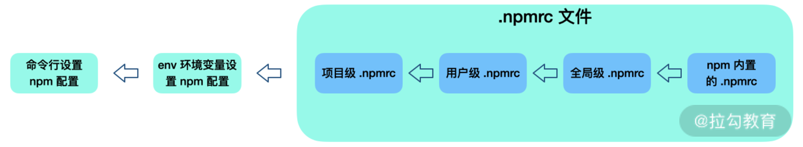

# **NPM**

1. 删除node_module和loackfiles， 再重新install， 这样操作是否存在风险
2. 把所有依赖都安装到dependencies , 不缺分devDependencies 会有问题
3. 我们的应用依赖了公共库 A 和公共库 B，同时公共库 A 也依赖了公共库 B，那么公共库 B 会被多次安装或重复打包吗？

4. 一个项目中，既有人用 npm，也有人用 Yarn，这会引发什么问题？

5. 我们是否应该提交 lockfiles 文件到项目仓库呢？

### **npm 内部机制和核心原理**

npm install 执行之后，首先，检查并获取 npm 配置，这里的优先级为：**项目级的 .npmrc 文件** > **用户级的 .npmrc 文件**> **全局级的 .npmrc 文件** > **npm 内置的 .npmrc 文件**。

然后检查项目中是否有 package-lock.json 文件。

如果有，则检查 package-lock.json 和 package.json 中声明的依赖是否一致：

* 一致，直接使用 package-lock.json 中的信息，从缓存或网络资源中加载依赖；

* 不一致，按照 npm 版本进行处理（不同 npm 版本处理会有不同，具体处理方式如图所示）。

如果没有，则根据 package.json 递归构建依赖树。然后按照构建好的依赖树下载完整的依赖资源，在下载时就会检查是否存在相关资源缓存：

* 存在，则将缓存内容解压到 node_modules 中；

* 否则就先从 npm 远程仓库下载包，校验包的完整性，并添加到缓存，同时解压到 node_modules。

最后生成 package-lock.json。

构建依赖树时，当前依赖项目不管其是直接依赖还是子依赖的依赖，都应该按照扁平化原则，优先将其放置在 node_modules 根目录（最新版本 npm 规范）。在这个过程中，遇到相同模块就判断已放置在依赖树中的模块版本是否符合新模块的版本范围，如果符合则跳过；不符合则在当前模块的 node_modules 下放置该模块（最新版本 npm 规范）。

## **npm 缓存机制**


**对于一个依赖包的同一版本进行本地化缓存，是当代依赖包管理工具的一个常见设计**。使用时要先执行以下命令：

```
npm config get cache
```

得到配置缓存的根目录在 /Users/cehou/.npm（ Mac OS 中，npm 默认的缓存位置） 当中。我们 cd 进入 /Users/cehou/.npm 中可以发现_cacache文件。事实上，在 npm v5 版本之后，缓存数据均放在根目录中的_cacache文件夹中。

我们可以使用以下命令清除 /Users/cehou/.npm/_cacache 中的文件：

```
npm cache clean -force
```

接下来打开_cacache文件，看看 npm 缓存了哪些东西，一共有 3 个目录：

* content-v2

* index-v5

* tmp

其中 content-v2 里面基本都是一些二进制文件。为了使这些二进制文件可读，我们把二进制文件的扩展名改为 .tgz，然后进行解压，得到的结果其实就是我们的 npm 包资源。

而 index-v5 文件中，我们采用跟刚刚一样的操作就可以获得一些描述性的文件，事实上这些内容就是 content-v2 里文件的索引。

这些缓存如何被储存并被利用的呢？

这就和 npm install 机制联系在了一起。当 npm install 执行时，通过pacote把相应的包解压在对应的 node_modules 下面。npm 在下载依赖时，先下载到缓存当中，再解压到项目 node_modules 下。pacote 依赖npm-registry-fetch来下载包，npm-registry-fetch 可以通过设置 cache 属性，在给定的路径下根据IETF RFC 7234生成缓存数据。

接着，在每次安装资源时，根据 package-lock.json 中存储的 integrity、version、name 信息生成一个唯一的 key，这个 key 能够对应到 index-v5 目录下的缓存记录。如果发现有缓存资源，就会找到 tar 包的 hash，根据 hash 再去找缓存的 tar 包，并再次通过pacote把对应的二进制文件解压到相应的项目 node_modules 下面，省去了网络下载资源的开销。


### **npm 不完全指南**

**自定义 npm init**

npm 支持我们自定义 npm init，快速创建一个符合自己需求的自定义项目。想象一下，npm init 命令本身并不复杂，它其实就是调用 shell 脚本输出一个初始化的 package.json 文件。那么相应地，我们要自定义 npm init 命令，就是写一个 node 脚本而已，它的 module.exports 即为 package.json 配置内容。

```js

const desc = prompt('请输入项目描述', '项目描述...')
module.exports = {
  key: 'value',
  name: prompt('name?', process.cwd().split('/').pop()),
  version: prompt('version?', '0.0.1'),
  description: desc,
  main: 'index.js',
  repository: prompt('github repository url', '', function (url) {
    if (url) {
      run('touch README.md');
      run('git init');
      run('git add README.md');
      run('git commit -m "first commit"');
      run(`git remote add origin ${url}`);
      run('git push -u origin master');
    }
    return url;
  })
}
```
假设该脚本名为 .npm-init.js，我们执行下述命令来确保 npm init 所对应的脚本指向正确的文件：

```
npm config  setinit-module ~\.npm-init.js
```

我们也可以通过配置 npm init 默认字段来自定义 npm init 的内容：

```
npm config set init.author.name "Lucas"
npm config set init.author.email "lucasXXXXXX@gmail.com"
npm config set init.author.url "lucasXXXXX.com"
npm config set init.license "MIT"
```

**利用 npm link，高效率在本地调试以验证包的可用性**


当我们开发一个公共包时，总会有这样的困扰：假如我开发一个组件库，某个组件开发完成之后，如何验证该组件能在我的业务项目中正常运行呢？

除了写一个完备的测试以外，常见的思路就是在组件库开发中，设计 examples 目录或者一个 playground，启动一个开发服务，以验证组件的运行情况。

然而真实应用场景是多种多样的，如果能在某个项目中率先尝试就太好了。但我们又不能发布一个不安全的包版本供业务项目使用。另一个“笨”方法是，手动复制粘贴组件并打包产出到业务项目的 node_modules 中进行验证，但是这种做法既不安全也会使得项目混乱，变得难以维护，同时过于依赖手工执行，这种操作非常原始。

那么如何高效率在本地调试以验证包的可用性呢？这个时候，我们就可以使用 npm link。简单来说，它可以**将模块链接到对应的业务项目中运行**。

我们来看一个具体场景，假设你正在开发项目 project 1，其中有个包 package 1，对应 npm 模块包名称是 npm-package-1，我们在 package 1 项目中加入了新功能 feature A，现在要验证在 project 1 项目中能否正常使用 package 1 的 feature A，你应该怎么做？


我们先在 package 1 目录中，执行 npm link，这样 npm link 通过链接目录和可执行文件，实现 npm 包命令的全局可执行。


然后在 project 1 中创建链接，执行 npm link npm-package-1 命令时，它就会去 /usr/local/lib/node_modules/ 这个路径下寻找是否有这个包，如果有就建立软链接。

这样一来，我们就可以在 project 1 的 node_module 中会看到链接过来的模块包 npm-package-1，此时的 npm-package-1 就带有最新开发的 feature A，这样一来就可以在 project 1 中正常开发调试 npm-package-1。当然别忘了，调试结束后可以执行 npm unlink 以取消关联。

从工作原理上总结，npm link 的本质就是软链接，它主要做了两件事：

* 为目标 npm 模块（npm-package-1）创建软链接，将其链接到全局 node 模块安装路径 /usr/local/lib/node_modules/ 中；

* 为目标 npm 模块（npm-package-1）的可执行 bin 文件创建软链接，将其链接到全局 node 命令安装路径 /usr/local/bin/ 中。

通过刚才的场景，你可以看到：**npm link 能够在工程上解决依赖包在任何一个真实项目中进行调试的问题，并且操作起来更加方便快捷。**


**npx 的作用**

> 它可以直接执行 node_modules/.bin 文件夹下的文件。在运行命令时，npx 可以自动去 node_modules/.bin 路径和环境变量 $PATH 里面检查命令是否存在，而不需要再在 package.json 中定义相关的 script。

> npx 执行模块时会优先安装依赖，但是在安装执行后便删除此依赖，这就避免了全局安装模块带来的问题。

**npm 多源镜像和企业级部署私服原理**

**npm 中的源（registry），其实就是一个查询服务**。以 npmjs.org 为例，它的查询服务网址是 https://registry.npmjs.org/。这个网址后面跟上模块名，就会得到一个 JSON 对象，里面是该模块所有版本的信息。比如，访问 https://registry.npmjs.org/react，就会看到 react 模块所有版本的信息。


我们可以通过npm config set命令来设置安装源或者某个 scope 对应的安装源，很多企业也会搭建自己的 npm 源。我们常常会碰到需要使用多个安装源的项目，这时就可以通过 npm-preinstall 的钩子，通过 npm 脚本，在安装公共依赖前自动进行源切换：

```js
"scripts": {
  "preinstall": "node ./bin/preinstall.js"
}
```

其中 preinstall.js 脚本内容，具体逻辑为通过 node.js 执行npm config set命令，代码如下：

```js
require(' child_process').exec('npm config get registry', function(error, stdout, stderr) {
  if (!stdout.toString().match(/registry\.x\.com/)) {
    exec('npm config set @xscope:registry https://xxx.com/npm/')
  }
})


```

内很多开发者使用的 nrm（npm registry manager）是 npm 的镜像源管理工具，使用它可以快速地在 npm 源间切换，这当然也是一种选择。

你的公司是否也正在部署一个私有 npm 镜像呢？你有没有想过公司为什么要这样做呢？

虽然 npm 并没有被屏蔽，但是下载第三方依赖包的速度依然较缓慢，**这严重影响 CI/CD 流程或本地开发效率**。部署镜像后，一般可以**确保高速、稳定的 npm 服务**，而且使**发布私有模块更加安全**。除此之外，审核机制也可以保障私服上的 npm 模块质量和安全。

那么，如何部署一个私有 npm 镜像呢？

现在社区上主要有 3 种工具来搭建 npm 私服：nexus、verdaccio 以及 cnpm。


**npm 配置作用优先级**

npm 可以通过默认配置帮助我们预设好 npm 对项目的影响动作，但是 npm 的配置优先级需要开发者确认了解。

如下图所示，优先级从左到右依次降低。我们在使用 npm 时需要了解 npm 的设置作用域，排除干扰范围，以免一顿骚操作之后，并没有找到相应的起作用配置。


npm 包的安装顺序对于依赖树的影响很大。模块安装顺序可能影响 node_modules 内的文件数量。

```
npm dedupe
```


