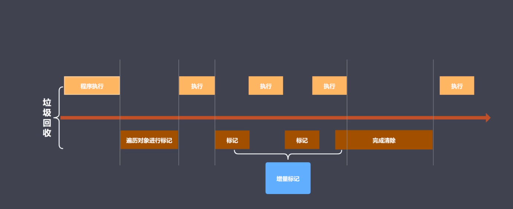

# 认识V8

* v8是一款主流的JS执行引擎

* V8采用即时编码，将源码翻译成可以执行的机器码；

* V8内存设限，64位操作系统不超过1.5g， 32位不超过800m；

### V8垃圾回收策略

> 基础数据回收由语言本身来控制的， 我们这里说的数据指的是当前存活在堆区的对象数据

* 采用分代回收的思想

* 内存分为新生代、老生代

* 针对不同对象采用不同算法

  

### V8中常用CG算法

* 分代回收

* 空间复制

* 标记清除

* 标记整理

* 标记增量

### V8如何回收新生代对象

 * V8内存分配

    * V8内存空间一分为二

    * 小空间用语存储新生代对象（32M | 16M）

    * 新生代指的是存活时间较短的对象

  * 新生代对象回收实现

    * 回收过程采用复制算法 + 标记整理算法

    * 新生代内存区分为二个等大小空间

    * 使用空间为From， 空闲空间为 To

    * 活动对象存储于From空间（代码执行得时候申请空间首先会把变量对象分配到from空间）

    * 标记整理后将活动对象拷贝至To

    * From 与 To 交换空间完成释放

      #### 回收细节说明

          * 拷贝过程中可能出现晋升

          * 晋升就是将新生代对象移动至老生代

          * 一轮CG还存活的新生代需要晋升

          * To空间的使用率超过25%（进行回收操作的时候，from和to空间会进行交换，如果使用率过高，将来变成使用状态时，新进来数据的空间可能不太够用）；

### V8如何回收老生代空间

* 老年代对象存放在右侧老生代区域

* 64位操作系统1.4G, 32操作系统700M

* 老年带对象就是指存活之间较长的对象(闭包， 全局对象上的对象)

  #### 老年代对象回收实现

  * 主要采用标记清除、 标记整理、 增量标记算法

  * 首先使用标记清除完成垃圾空间的回收

  * 采用标记整理进行空间优化（新生代区域内容往老生代空间移动的时候，当老生代区域空间不足以来存储新生代移过来的对象）

  * 采用增量标记进行效率优化

    ### 细节对比

    * 新生代区域垃圾回收使用空间换时间

    * 老生代区域垃圾回收不适合复制算法（空间较大， 老生代存放数据较多，如果复制花费的时间较多）

    * 垃圾回收会堵塞程序执行， 因此我们使用增量标记进行, 先进行标记直接可达对象， 执行， 标记二级可达对象， 以此类推， 标记完成后 完成清除；
    

