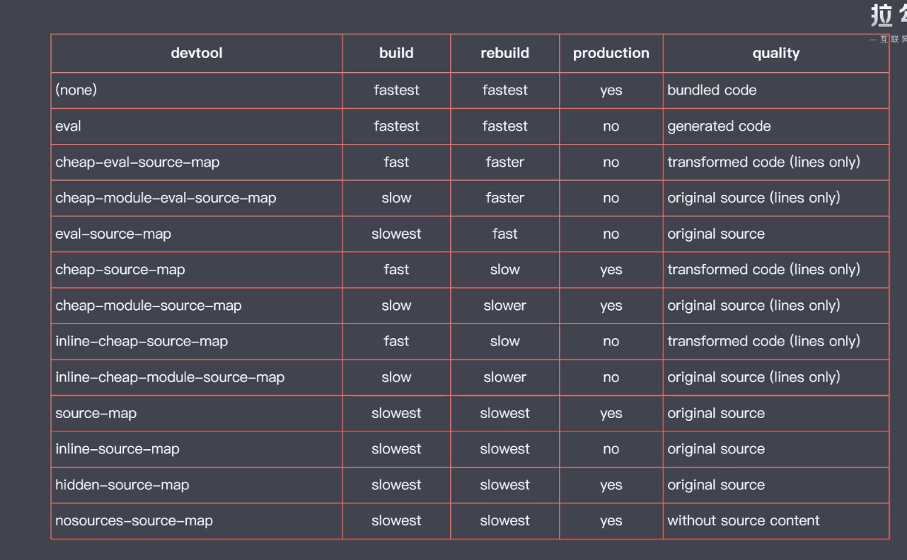

# 模块打包工具

1. 存在问题
   
    * ESM存在环境兼容问题

    * 模块文件过多，网络请求频繁

    * 所有的前端资源都需要模块化

    * 新特性代码编译

    * 模块化js打包

    * 要支持不同类型的资源模块

2. webpack

   > 模块打包器，解决的是前端整体的模块化，并不单指JS模块化
   
    * 在打包过程中通过模块加载器来对模块进行编译转换

    * 具备代码拆分能力

    * 以模块化的方式加载任意资源文件

3. 快速上手
   
   ```
   yarn add webpack webpack-cli --dev

   // 打包模式    production 优化打包结果  development 优化打包速度
   yarn webpack --mode development/none/production
   ```
   * entry 中 './' 不能省略

   * output 设置输出文件路径  

   ```
   output: {
     filename: 'bundle.js',
     // 必须为绝对路径
     path: path.join(__dirname, 'output')
   }
   ```

   * webpack4 之后的版本支持0配置启动打包， 按照约定将src下的indexjs作为入口文件

    1. 打包结果运行原理
      
       * 将模块数组传入依次执行 ？

    2. 资源模块加载

        > 是webpack实现模块化打包的核心， 通过loader可以加载任何类型的资源

        * 加载器， 默认只能处理js

    3. 样式文件在js文件中引入
      
        * js驱动整个前端

        * 逻辑合理， 就是确实需要这些自愿文件
        * 确保上线资源不缺失， 都是必要的

    4. 文件资源加载器

        * 通过拷贝物理路径返回到js

    5. datd URL

        * 小文件使用DATA URLs 减少请求次数
        * 大文件单独提取

        * limit ： 

          * 超出10kb文件单独提取存放， 
          * 小于10kb文件转换为dataurls嵌入代码中

    6.  常用加载器分类
      
        * 编译转换类

        * 文件操作类型 拷贝到输出目录

        * 代码质量检查类 ，统一代码风格，提高代码质量
    
    7. 处理 ES2015

       * 下载加载器

        ```
        yarn add babel-loader @babel/core @babel/preset-env
        ```

        * webpack 只是打包工具

        * 加载器可以用来编译转换代码
    
    8. webpack模块加载方式
       
       * 遵循 ES Module 标准的import 声明

       * 遵循 CommonJS 标准的require 函数

       * 尊村AMD 标准的define函数和require

       * *样式代码中的@import 指令和url函数

       * * HTML代码中图片标签的src属性

    9. webpack核心

       * loader机制是webpack的核心
    
    10. webpack loader 的原理
      
        1. 加载器返回为js代码字符串
        
        2. 可经过多个加载器加工

        3. loader 是一个管道功能

    11. webpack 插件机制
        > 实现前端工程化

        1. 解决除了资源加载的其他工作

        2. 拷贝静态文件至输出目录

        3. 压缩输出代码

4. 常用插件
   
   1. clean-webpack-plugin: 自动情理输出目录的插件

      ```
      yarn add clean-webpack-plugin --dev

      const { CleanWebpackPlugin } = require('clean-webpack-plugin');

      plugins: [
        new CleanWebpackPlugin();
      ]

      ```

   2. html-webpack-plugin:   通过webpack输出html文件

      ```
      yarn add html-webpack-plugin --dev

      const HtmlWebpackPlugin = require('html-webpack-plugin');

      plugins: [
        new HtmlWebpackPlugin();
      ]
      ```

      * 设置html模板， lodash模板语法

      * 同时输出多个html文件

        ```
        new HtmlWebpackPlugin({
          filename: 'about.html'
        }),
        ```
    3. 拷贝静态资源

        ```
        yarn add clean-webpack-plugin --dev
        ```

5. 开发插件

   1. plugin 通过钩子机制实现
   
   2. 一个函数或者是一个包含apply方法的对象

6. 开发体验设想

   1. http server 运行

   2. 自动编译 + 自动刷新

   3. 提供 source-map

7. webpack 增强开发体验

   > 实现自动编译

    1. watch 工作模式

       - 监听文件变化， 自动重新打包

        ```
        yarn webpack --watch
        ```

    2. 自动刷新页面  BrowserSync

        ```
        browser-sync dist --files "**/*"
        ```

    3. webpack devserver : 提供用于开发http server

        > 集成自动集成 和自动刷新浏览器 , 将打包结果暂时存放在内存


        ```

        yarn add webpack-dev-server

        yarn webpack-dev-server --open

        ```

       * dev server 默认会将构建结果输出文件作为开发服务器的资源文件， 如果其他静态资源文件也需要serve

        ```
          devServer: {
            contentBase: ['./public']
          },
        ```

    4. 代理api

        跨域请求： 

        1. 跨域资源共享(CORS): 可以使用这个前提是api必须支持， 但是同源部署不需要CORS
       
        2. 开发服务器设置代理服务

    5. 调试应用 

          source map: 可以通过打包后代码逆向解析成源代码

          ```
          // 引用sourcemap文件
          //# sourceMappingURL=jquery-3.4.1.min.map
          ```
          webpack 配置 source map(webpack 有12种, 每种方式的效率和效果各不相同)
          

          ```
          devtool: 'source-map',
          ```
          * eval 模式

             将转换过后的代码放在eval方法中执行  ，用过sourceURL来确定源代码文件路径

          * 不同devtool模式

            * eval: 没有生成source-map, 只能定位错误
            * eval-source-map: 生成了source-map， 定位到具体的行和列
            * cheap-eval-source-map: 只能定位到行， 生成了sourcemap
            * cheap-module-eval-source-map: 定位到行， 解析出来的源代码没有经过加工编译
            * inline-source-map: 使用data url方式插入sourcemap（基本不会用到）
            * hidden-source-map: 生产环境看不到source-map（适合第三方插件）
            * nosources-source-map: 看不到源代码

            * eval: 是否使用eval执行模块代码
            * cheap-source map 是否包含行信息
            * module： 是否能够得到loader处理之前的源代码
          
          * 选择合适的source map

            > 没有绝对的选择
            
            - 开发环境下 cheap-module-eval-source-map

              - 代码不会超过80字符
              - 代码经过loader转换过后的差异较大
              - 首次打包速度慢无所谓， 重写打包相对较快

            - 生产环境 none / nosources-source-map

              - source-map会暴露源代码
              - 调试是开发阶段的事情

        6. 自动刷新
            
            > 提供对开发者有好的开发服务器

        7. HMR(模块热更新)

           * 热拔插： 在一个运行的机器上随时拔插设备

           * 模块热更新： 运行过程中的及时替换， 运行状态不受影响

           * 自动刷新导致页面状态丢失。 热替换只将修改的模块实时替换至应用中
        
           * 启动HMR, css-loader 自动处理了热更新， js需要手动处理

           ```
           devServer: {
             hot: true
           },
           plugins: [
             new webpack.hotModuleReplacementPlugin()
           ]
           ```

           * APIS:
             
             ```js
             module.hot.accept('./editor', () => {
               // 处理替换逻辑
                console.log('ddddd')
              })
             ```
           * 注意事项
              
              1. 处理HMR的代码报错会导致自动刷新， 可使用 hotOnly
              2. module.hot使用了但是没有开启hot， 此时会报错，因为module.hot是hmr插件提供的
              3. 处理热更新的代码打包过后会自动去掉

8.  生产环境优化

    1. 配置文件根据不同的环境导出不同配置

    ```js
    module.exports = (env, args) {}
    ```

    2. 不同环境对应不同环境变量

    ```
     yarn add webpack-merge --dev

     // 合并配置

     merge(common, {
       mode: 'production',
     }

     yarn webpack --config webpack.prod.js
    ```

    3. definePlugin
      > 为代码注入全局成员

        ```js
        plugins: [
          new webpack.DefinePlugin({
            // 需要是代码片段
            API_BASE_URL: '"api"'
          })
        ]
        ```
    4. tree-shaking
      
       > 未引用代码dead-code, 会在生产环境下自动开启

       * 一组功能搭配过后的优化效果

       * treeshaking前提是esmodules去组织代码， 由webpack打包的代码必须使用esm
          ```
          // 用来设置webpack内置的一些优化
          optimization: {
            // 开启标识
            sideEffect: true,
            // 标记
            usedExports: true,
            // 压缩，删除无用代码
            minimize: true，
          // 尽可能将所有的模块合并输出到一个函数中， 提升了运行效率，又减少了代码体积， scope hoisting （ 作用域提升）
            concatenateModules: true,
            }
          ```
    5. sideEffect
         
         > 模块执行时除了导出成员之外所做的事情

         * sideeffect 一般用于npm包标记是否有副作用

         * 确保你的代码


         ```
         <!-- package.josn -->
         // 当前package.json 标识的代码都没有副作用
         // 没有副作用就会移除掉
         'sideEffect': false,
         'sideEffect': [
           '*.css',
           './src/extend.js'
         ]
         ```

    6. code spliting
        
        > 所有代码最终都会打包到一起， 导致bundle体积过大， 并不是每个模块都需要在启动时加载

        1. 分包，按需加载；

        2. 代码分包、代码分割；

        3. http1.1： 
           
           - 同域并行请求限制；

           - 每次请求都会有一定延迟

           - 请求的header浪费带宽流量

        4. 多入口打包： 适用于多页面打包， 公共部分单独提取

           ```
           entry: {
             index: './src/index.js',
             album: './src/album.js'
           },
           ouput: {
             filename: `[name].bundle.js`
           },
           plugins: [
             // 只引入单独的模块
             new HtmlWebpackPlugin({
               chunks: ['index'],
               filename: 'index.html'
             }),
             new HtmlWebpackPlugin({
               chunks: ['album'],
               filename: 'album.html'
             })
           ],
           optimization: {
             splitChunks: {
               // 将所有公共模块提取为单独的bundle中
               chunks: 'all'
             }
           }
           ```
        5. 动态导入/ 按需加载

           > 动态导入的模块会被自动分包

           ```
           // 按需加载
           import('').then()
           ```

        6. 魔法注释

           ```
           // 按需加载  设置包的名字， 相同的chunk name会被打包到一起
           import(/* webpackChunkName: 'posts'*/'').then(() => {

           })
           ```

        7.  MiniCssExtractPlugin

            ```
            yarn add mini-css-extract-plugin --dev

            plugins: [
              new MiniCssExtractPlugin({
                filename: '[name].bundle.css'
              })
            ],
            module: {
              rules: [
                {
                  test: /\.css$/,
                  use: [
                    // 将样式通过style 标签注入
                    MiniCssExtractPlugin.loader,
                    'css-loader'
                  ]
                }
              ]
            }
            ```
        8. OptimizeCssAssetsWebpackPlugin

           > 压缩css

            ```

            yarn add optimize-css-assets-webpack-plugin

            plugins: [
              // 任何时候都会压缩， 放在minimize里面，必须开启minimize才可以使用
              new OptimizeCssAssetsWebpackPlugin(),
            ]

            ```

            ```
            // 添加js压缩  
            // 配置了minimizer， 则默认认为自定义压缩，会覆盖之前的默认压缩
            yarn add  terser-webpack-plugin

            optimization: {
              minimizer: {
                new OptimizeCssAssetsWebpackPlugin(),
                new TerserWebpackPlugin();
              }
            }
            ```

    7.  静态资源 
        

        * 生产模式下，文件名使用hash

        1. filename: `[name]-[hash].bundle.js`

        2. 根据chunk hash  filename: `[name]-[chunkhash].bundle.js`

        3. 文件级别 filename: `[name]-[contenthash:8].bundle.js`, 指定hash位数
           
