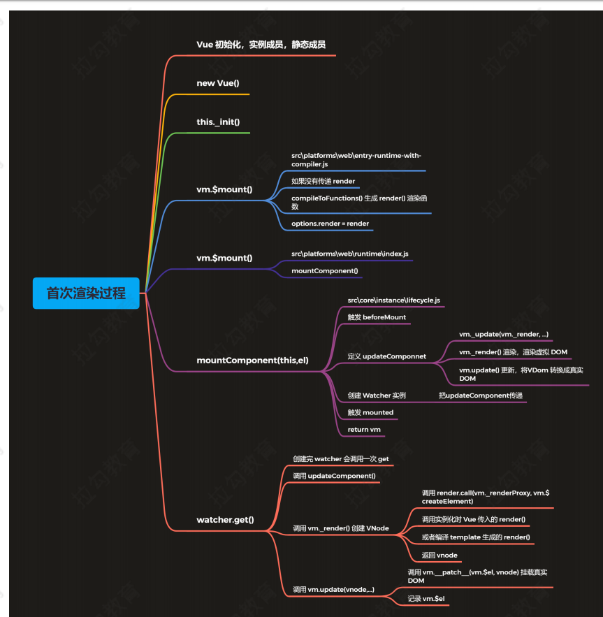

# vue 源码

1. vue 静态成员源码

   >  src/core/global-api/index.js

  *  定义`vue.config`

  *  静态方法 `Vue.set\Vue.delete\Vue.nextTick`

  * 设置响应式对象 

    ```js
    Vue.observer = <T>(obj: T): T => {
      observer(obj)
      return obj
    }
    ```
  * 初始化 `components/directives/filters`

    ```js
    Vue.options = Object.create(null)
    ASSET_TYPES.forEach(type => {
      Vue.options[type + 's'] = Object.create(null)
    })
    ```

  * 注册内置组件`keep-alive`

  * 注册`vue.user()`

  * 注册`vue.mixin()`

  * 注册`vue.extend()`, 基于传入的options返回一个组件的构造函数

  * 注册`vue.directive()、 vue.component(), vue.filter()`

2. vue的实例成员
   
   > src/core/instance/index.js

   


3. 响应式原理
   
   * 通过查看源码解决下面问题
     
     - `vm.msg = { count: 0 }`, 重新给属性赋值，是否是响应式的；

     - `vm.arr[0] = 4`, 给数组元素赋值， 视图是否会更新；

     - `vm.arr.length = 0`, 修改数组的length, 视图是否会更新

     - `vm.arr.push(4)`， 视图是否会更新；

   * 响应式处理的入口
     
     整个响应式处理的过程是比较复杂的，下面我们先从
       
       * src\core\instance\init.js
         
         - initState(vm) vm的状态初始化

         - 初始化了 _data、 _props、 methods 等

       * src\core\instance\state.js

4. watcher类

   * watcher 分为三种， computed watcher、 用户 watcher （侦听器）、 渲染watcher

   * 渲染watcher 的创建时机

      - /src/core/instance/lifecycle.js

   * 调试响应式数据执行过程
      
      - 数组响应式处理的核心过程和数组收集依赖的过程

      - 当数组的数据改变的时候watcher的执行过程

5. vm.$set

     > 回顾  defineReactive 中的 childOb，给每一个响应式对象设置一个 ob
调用 $set 的时候，会获取 ob 对象，并通过 ob.dep.notify() 发送通知


   功能

   向响应式对象中添加一个属性，并确保这个新属性同样是响应式的，且触发视图更新。它必须用于
   向响应式对象上添加新属性，因为 Vue 无法探测普通的新增属性 (比如this.myObject.newProperty = 'hi')

   注意：对象不能是 Vue 实例，或者 Vue 实例的根数据对象。

  * 示例

    ```js
    vm.$set(obj, 'foo', 'test')
    ```

    **定义位置**
    
    * Vue.set()
      
      - global-api/index.js

    * vm.$set()

      - instance/index.js

6. vm.$delete

* 功能

  删除对象的属性。如果对象是响应式的，确保删除能触发更新视图。这个方法主要用于避开 Vue
不能检测到属性被删除的限制，但是你应该很少会使用它。

  > 注意：目标对象不能是一个 Vue 实例或 Vue 实例的根数据对象。

  * 示例

  ```js
  vm.$delete(vm.obj, 'msg')
  ```

    **定义位置**

  * Vue.delete()

    - global-api/index.js

  * vm.$delete()

    - instance/index.js

    - src\core\observer\index.js

7. vm.$watch

    > `vm.$watch( expOrFn, callback, [options] )`

  * 功能

    观察 Vue 实例变化的一个表达式或计算属性函数。回调函数得到的参数为新值和旧值。表达式只
接受监督的键路径。对于更复杂的表达式，用一个函数取代。

  * 参数

    - expOrFn：要监视的 $data 中的属性，可以是表达式或函数

    - callback：数据变化后执行的函数

       - 函数：回调函数

       - 对象：具有 handler 属性(字符串或者函数)，如果该属性为字符串则 methods 中相应的定义

    - options：可选的选项

      - deep：布尔类型，深度监听

      - immediate：布尔类型，是否立即执行一次回调函数

  * 三种类型的 Watcher 对象

    - 没有静态方法，因为 $watch 方法中要使用 Vue 的实例

    - Watcher 分三种：计算属性 Watcher、用户 Watcher (侦听器)、渲染 Watcher
    创建顺序：计算属性 Watcher、用户 Watcher (侦听器)、渲染 Watcher

    - vm.$watch()

      - src\core\instance\state.js

  * 调试

    - 查看 watcher 的创建顺序
        
      - 计算属性 watcher

      - 用户 wacher(侦听器)

      - 渲染 wacher

    - 查看渲染 watcher 的执行过程

      - 当数据更新，defineReactive 的 set 方法中调用 dep.notify()

      - 调用 watcher 的 update()

      - 调用 queueWatcher()，把 wacher 存入队列，如果已经存入，不重复添加

      - 循环调用 flushSchedulerQueue()

         - 通过 nextTick()，在消息循环结束之前时候调用 flushSchedulerQueue()

      - 调用 wacher.run()

        - 调用 wacher.get() 获取最新值

        - 如果是渲染 wacher 结束

        - 如果是用户 watcher，调用 this.cb()

8. 异步更新队列-nextTick()

    * Vue 更新 DOM 是异步执行的，批量的

      - 在下次 DOM 更新循环结束之后执行延迟回调。在修改数据之后立即使用这个方法，获取更
    新后的 DOM。

    * `vm.$nextTick(function () { /* 操作 DOM */ }) / Vue.nextTick(function () {})`

    * 定义位置
    
      - src\core\instance\render.js

    * 源码

      - 手动调用 vm.$nextTick()
      - 在 Watcher 的 queueWatcher 中执行 nextTick()
      - src\core\util\next-tick.js


