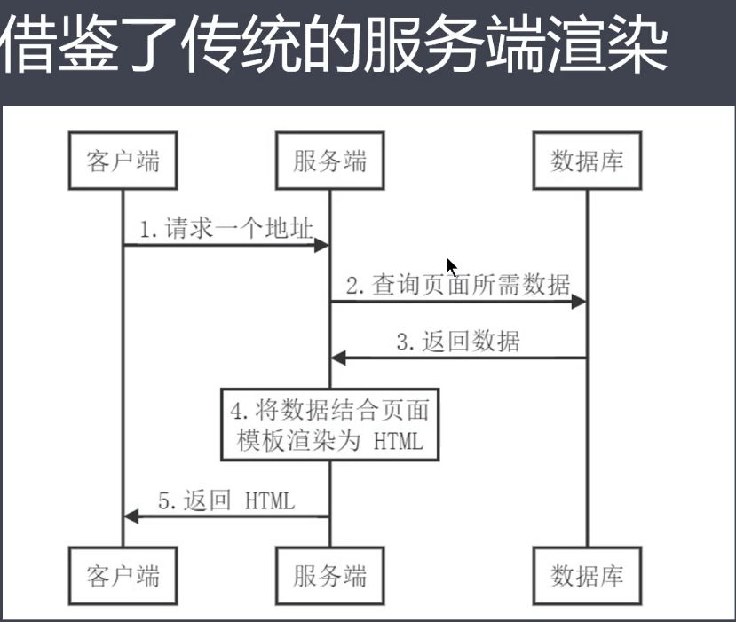

# 服务端渲染

1. SPA 页面

    * 优点
      
      - 用户体验好

      - 开发效率高

      - 渲染性能好

      - 可维护性好

      - ...

    * 缺点

      - 首屏渲染时间长

      - 不利于SEO

2. 服务端渲染

    ### 借鉴了传统的服务端渲染
   
   

   ### 客服端激活为SPA

   

   ### 同构应用

    * 通过服务端渲染首屏直出， 解决spa应用首屏渲染慢以及不利于seo 问题

    * 通过客户端渲染接管页面内容交互得到更好的用户体验

    * 这种方式通常陈伟现代化的服务端渲染， 也叫同构渲染

