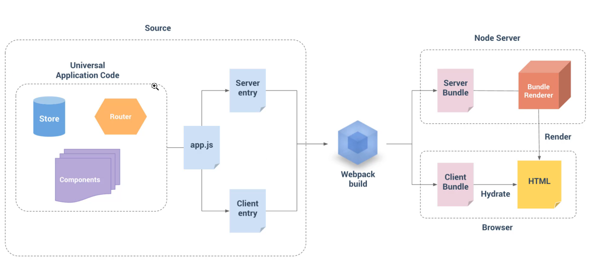

## SSR

- 官方文档：https://ssr.vuejs.org/

- Vue SSR（Vue.js Server-Side Rendering） 是 Vue.js 官方提供的一个服务端渲染（同构应用）解
  决方案

- 使用它可以构建同构应用

- 还是基于原有的 Vue.js 技术栈

> 官方文档的解释：Vue.js 是构建客户端应用程序的框架。默认情况下，可以在浏览器中输出 Vue组件，进行生成 DOM 和操作 DOM。然而，也可以将同一个组件渲染为服务器端的 HTML 字符
串，将它们直接发送到浏览器，最后将这些静态标记"激活"为客户端上完全可交互的应用程序。服务器渲染的 Vue.js 应用程序也可以被认为是"同构"或"通用"，因为应用程序的大部分代码都可以在服务器和客户端上运行。

### 使用场景

在对你的应用程序使用服务器端渲染 (SSR) 之前，你应该问的第一个问题是，是否真的需要它

技术层面：

- 更快的首屏渲染速度

- 更好的 SEO

业务层面：

- 不适合管理系统

- 适合门户资讯类网站，例如企业官网、知乎、简书等

- 适合移动网站

### 如何实现 Vue SSR

#### 渲染一个 Vue 实例

> 了解如何使用 VueSSR 将一个 Vue 实例渲染为 HTML 字符串

首先我们来学习一下服务端渲染中最基础的工作：模板渲染。

说白了就是如何在服务端使用 Vue 的方式解析替换字符串。

在它的官方文档中其实已经给出了示例代码，下面我们来把这个案例的实现过程以及其中含义演示一
下。

```
mkdir demo01
cd demo01
npm install vue vue-server-renderer
```

serve.js

```js
// 第 1 步：创建一个 Vue 实例
const Vue = require("vue");
const app = new Vue({
  template: `<div>{{ message }}</div>`,
  data: {
    message: "Hello World",
  },
});
// 第 2 步：创建一个 renderer
const renderer = require("vue-server-renderer").createRenderer();
// 第 3 步：将 Vue 实例渲染为 HTML
renderer.renderToString(app, (err, html) => {
  if (err) throw err;
  console.log(html);
  // => <div data-server-rendered="true">Hello World</div>
});
// 在 2.5.0+，如果没有传入回调函数，则会返回 Promise：
renderer
  .renderToString(app)
  .then((html) => {
    console.log(html);
  })
  .catch((err) => {
    console.error(err);
  });
```

## 与服务器集成

在 Node.js 服务器中使用时相当简单直接，例如 Express。

1. 首先安装 Express 到项目中：

   `npm i express`

   然后使用 Express 创建一个基本的 Web 服务：

   ```js
   const express = require("express");
   const app = express();
   app.get("/", (req, res) => {
     res.send("Hello World!");
   });
   app.listen(3000, () =>
     console.log("app listening at http://localhost:port")
   );
   ```

2. 启动 Web 服务：

   `nodemon serve.js`

   在 Web 服务中渲染 Vue 实例：

   ```js
   const Vue = require("vue");
   const server = require("express")();
   const renderer = require("vue-server-renderer").createRenderer();
   server.get("*", (req, res) => {
     const app = new Vue({
       data: {
         url: req.url,
       },
       template: `<div>访问的 URL 是： {{ url }}</div>`,
     });
     renderer.renderToString(app, (err, html) => {
       if (err) {
         res.status(500).end("Internal Server Error");
         return;
       }
       res.end(`
      <!DOCTYPE html>
      <html lang="en">
      <head>
      <title>Hello</title>
      <meta charset="UTF-8">
      </head>
      <body>${html}</body>
      </html>
      `);
     });
   });
   server.listen(8080);
   ```

## 同构渲染

### 构建流程



### 源码结构

我们需要使用 webpack 来打包我们的 Vue 应用程序。事实上，我们可能需要在服务器上使用
webpack 打包 Vue 应用程序，因为：

- 通常 Vue 应用程序是由 webpack 和 vue-loader 构建，并且许多 webpack 特定功能不能直接在 Node.js 中运行（例如通过 file-loader 导入文件，通过 css-loader 导入 CSS）。

- 尽管 Node.js 最新版本能够完全支持 ES2015 特性，我们还是需要转译客户端代码以适应老版浏览器。这也会涉及到构建步骤。

所以基本看法是，对于客户端应用程序和服务器应用程序，我们都要使用 webpack 打包 - 服务器需要「服务器 bundle」然后用于服务器端渲染(SSR)，而「客户端 bundle」会发送给浏览器，用于混合静态标记。

现在我们正在使用 webpack 来处理服务器和客户端的应用程序，大部分源码可以使用通用方式编写，可以使用 webpack 支持的所有功能。同时，在编写通用代码时，有一些事项要牢记在心。

一个基本项目可能像是这样：

```
src
├── components
│ ├── Foo.vue
│ ├── Bar.vue
│ └── Baz.vue
├── App.vue
├── app.js # 通用 entry(universal entry)
├── entry-client.js # 仅运行于浏览器
└── entry-server.js # 仅运行于服务器

```

## `app.js`

app.js 是我们应用程序的「通用 entry」。在纯客户端应用程序中，我们将在此文件中创建根 Vue 实
例，并直接挂载到 DOM。但是，对于服务器端渲染(SSR)，责任转移到纯客户端 entry 文件。 app.js
简单地使用 export 导出一个 createApp 函数：

```js
import Vue from "vue";
import App from "./App.vue";
// 导出一个工厂函数，用于创建新的
// 应用程序、router 和 store 实例
export function createApp() {
  const app = new Vue({
    // 根实例简单的渲染应用程序组件。
    render: (h) => h(App),
  });
  return { app };
}
```

## `entry-client.js`

客户端 entry 只需创建应用程序，并且将其挂载到 DOM 中：

```js
import { createApp } from "./app";
// 客户端特定引导逻辑……
const { app } = createApp();
// 这里假定 App.vue 模板中根元素具有 `id="app"`
app.$mount("#app");
```

## `entry-server.js`

服务器 entry 使用 default export 导出函数，并在每次渲染中重复调用此函数。此时，除了创建和返回应用程序实例之外，它不会做太多事情 - 但是稍后我们将在此执行服务器端路由匹配 (server-side route matching) 和数据预取逻辑 (data pre-fetching logic)。

```js
import { createApp } from "./app";
export default (context) => {
  const { app } = createApp();
  return app;
};
```

## `server.js`

```js
/**
 * 通用应用 Web 服务启动脚本
 */
const express = require("express");
const Vue = require("vue");
const VueServerRenderer = require("vue-server-renderer");
const fs = require("fs");
// 创建一个 express 实例
const server = express();
// 生成一个渲染器
const renderer = VueServerRenderer.createRenderer({
  // 渲染器就会自动把渲染的结果注入到模板中
  template: fs.readFileSync("./index.html", "utf-8"),
});
const createApp = () => {
  const app = new Vue({
    template: `
<div id="app">
<h1>Hello {{ message }}</h1>
<input v-model="message">
</div>
`,
    data: {
      message: "World",
    },
  });
  return app;
};
server.get("/foo", (req, res) => {
  const app = createApp();
  app.message = "世界";
  res.end("foo");
});

// 设置一个路由
server.get("/", async (req, res) => {
  // const app = new Vue({
  // template: `
  // <div id="app">
  // <h1>Hello {{ message }}</h1>
  // <input v-model="message">
  // </div>
  // `,
  // data: {
  // message: 'World'
  // }
  // })
  try {
    const app = createApp();
    const ret = await renderer.renderToString(app, {
      title: "自定义页面标题",
      meta: `
<meta name="description" content="hello world">
`,
    });
    res.end(ret);
  } catch (err) {
    res.status(500).end("Internal Server Error.");
  }
});
// 监听端口，启动 Web 服务
server.listen(3000, () => {
  console.log("running at port 3000.");
});
```

## `index.template.html`

```html
<!DOCTYPE html>
<html lang="en">
<head>
<meta charset="UTF-8">
<meta name="viewport" content="width=device-width, initial-scale=1.0">
<title>拉勾教育</title>
</head>
<body>
<!-- 服务端渲染的内容出口 -->
<!--vue-ssr-outlet-->
</body>
</html>
```


# 构建配置

## 安装依赖

（1） 安装生产依赖

```
npm i vue vue-server-renderer express cross-env
```

（2） 安装开发依赖

```
npm i -D webpack webpack-cli webpack-merge webpack-node-externals @babel/core
@babel/plugin-transform-runtime @babel/preset-env babel-loader css-loader urlloader
file-loader rimraf vue-loader vue-template-compiler friendly-errorswebpack-plugin
```


